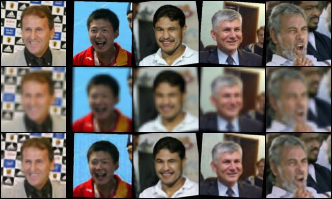

# CNN を用いた回帰モデルによる画像のUpSmplingを行う

- ここでは，様々な人の顔の画像データに対して128 x 128 ピクセルの画像Aとされを　32 x 32に縮小した画像Bを用意する．
- この際に，画像Bを128 x 128のサイズに拡大した結果と画像Aの各ピクセル値の誤差をとり，これを小さくしていく学習を行う．

### データの準備
- 以下のサイトから画像を準備しました．
    - http://vis-www.cs.umass.edu/lfw/
        - ダウンロードリンク: http://vis-www.cs.umass.edu/lfw/lfw-deepfunneled.tgz
- これを頭文字がX・Y・Zで始まる人物の画像データをtestデータに，それ以外をtrainデータにしました．
- Linux or MacOSの方はlfw-deepfunneled/* にtrain, testディレクトリを用意していただけると以下のコマンドで移動できます.(ディレクトリ構造は<you_current_working_directory>/lfw-deepfunneled/*)を想定しています
    - `mv lfw-deepfunneled/[A - W]* train/`
    - `mv lfw-deepfunneled/[X-Z]* test/`
    - 訓練データの数は13071枚

## 結果
- 128 $\times$ 128の画像を32 $\times$ 32にしてからもう一度 ,128 $\times$ 128にup-samplingする.
- 以下の画像は上から順に
  - original画像
  - Biliner補間による拡大画像
  - CNNを用いた拡大画像

